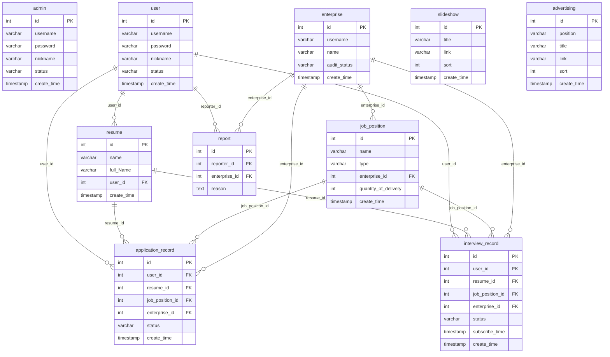

# recruitment_system 数据库 ER 图说明

- **来源**：`sql/sql.sql`（MySQL 8）
- **说明**：建表语句中**未定义物理外键**，下列连线表示业务上的参照关系（逻辑外键）。

## 表一览

| 表名 | 说明 |
|------|------|
| `admin` | 后台管理员 |
| `user` | 求职者 |
| `enterprise` | 企业 |
| `resume` | 简历（归属用户） |
| `job_position` | 职位（归属企业） |
| `application_record` | 投递记录 |
| `interview_record` | 面试记录 |
| `report` | 举报 |
| `slideshow` | 首页轮播 |
| `advertising` | 广告位 |

## ER 图（PNG）

已生成的位图（与下方 Mermaid 同源）：[`recruitment_system_er.png`](./recruitment_system_er.png)

## ER 图（Mermaid）

在支持 Mermaid 的编辑器（如 VS Code、GitHub、Typora）中可预览；也可用 [Mermaid Live Editor](https://mermaid.live) 导出 PNG/SVG。源文件：[`recruitment_system_er.mmd`](./recruitment_system_er.mmd)



## 关系摘要（文字）

```
user (1) ──────< resume
user (1) ──────< application_record >────── job_position (N)
                │              │
                └─ resume      └─ enterprise (N)
enterprise (1) ─< job_position
enterprise (1) ─< report >──── user (举报者)

interview_record：与 application_record 类似，关联 user、resume、job_position、enterprise

admin、slideshow、advertising：与其它业务表无外键关联（独立配置表）
```
